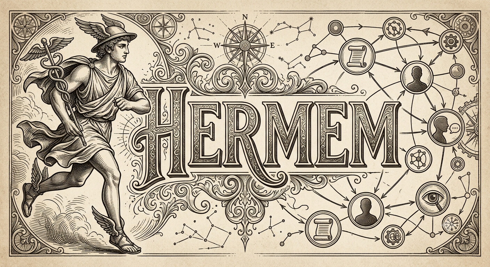

<p align="center">
  
</p>

<h1 align="center">Hermem</h1>

<p align="center">
Persistent graph memory for LLM agents.<br>
SQLite. Embeddings. Graph traversal. One binary.
</p>

<p align="center">
  
  
  
  
</p>
<p align="center">
  <a href="docs/OPENAPI.md"></a>
  <a href="docs/MCP.md"></a>
  <a href="docs/SDK.md"></a>
  <a href="docs/SDK.md"></a>
  <a href="docs/SDK.md"></a>
</p>

---

> **LLMs know almost everything. They just have the memory span of a goldfish.**
>
> Hermem gives AI agents something they've been missing since day one:
> **persistent, searchable, structured memory.**

Modern language models are stateless. Every conversation starts from zero. Every session forgets who you are. Every brilliant insight disappears forever once the context window scrolls away. Most AI applications solve this by sending bigger prompts. Some solve it by adding a vector database. Others invent five microservices, two queues, a cache layer, Kubernetes, and a distributed existential crisis. Hermem takes a different approach. It continuously extracts knowledge from conversations, stores it as a graph, enriches it with vector embeddings, tracks provenance, detects contradictions, understands temporal relationships, and retrieves only the information an LLM actually needs. No prompt archaeology. No copy-pasting previous conversations. No "please remember this."

---

# What is Hermem?

Hermem is a **graph-native long-term memory engine** for AI agents. Instead of remembering conversations, it remembers **knowledge**. Instead of storing documents, it stores **entities** connected by typed relationships. Instead of retrieving random text chunks, it retrieves **connected ideas**. Think of it as somewhere between

- Neo4j
- a vector database
- SQLite
- an episodic memory system
- a task planner
- and a second brain for autonomous agents.

All inside a **single executable**.

No external database. No Redis. No Elasticsearch. No Kafka. No cloud dependency. Just one binary.

---

# Why not just use RAG?

Classic RAG is document retrieval. Hermem is memory. Traditional RAG usually works like this:

```

User ➞ Embedding ➞ Vector Search ➞ Top 5 chunks ➞ LLM

```

Hermem works differently:

```

User ➞ Embedding ➞ Vector Search ➞ Seed entities ➞ Recursive Graph Walk ➞ Temporal ranking ➞ Centrality scoring ➞ Contradiction filtering ➞ Markdown context ➞ LLM

```

The vector search answers

> "Which memories are probably relevant?"

The graph answers

> "What else is connected to those memories?"

That difference sounds small.

It isn't.

---

# Design philosophy

Hermem intentionally prefers boring technology. Because boring technology survives production. Some examples:

| Instead of... | Hermem uses... |
|---------------|----------------|
| PostgreSQL cluster | SQLite |
| Distributed graph database | Recursive SQL CTE |
| Separate vector DB | SQLite + embeddings |
| Huge infrastructure | One executable |
| Runtime reflection everywhere | Static Go types |
| Framework magic | Explicit dependency injection |

The goal is not to build the biggest memory system. The goal is to build one that still works six months later.

---

## Features

- **CLI + HTTP server** — single binary, two modes
- **OpenAI-compatible** — works with Ollama or any OpenAI-compatible API
- **Separate embedder/extractor providers** — Ollama for embeddings, OpenAI for extraction (or vice versa)
- **Pluggable vector search** — `InMemoryVectorIndex` (default, pure-Go brute-force) or `SqliteVecIndex` via `sqlite-vec` (indexed KNN)
- **Accelerate SIMD** — `cblas_sgemv` via CGo for AMX-optimised batch dot products on Apple Silicon
- **Automatic retention** — configurable GC loop archives stale observation nodes
- **API key auth** — optional `X-API-Key` middleware
- **Structured logging** — `log/slog` with event fields + `request_id` tracing
- **Request tracing** — every HTTP response gets `X-Request-ID`
- **Metrics** — `/metrics` endpoint via `expvar`
- **Graceful shutdown** — drains in-flight requests on SIGINT/SIGTERM
- **Strict JSON validation** — unknown fields rejected with structured errors
- **State-on-Graph (Batch 9)** — stateful entities with `status`, configurable dependency relations, CTE-based executable-node walk, rollback lookup, `/task/status` + `/task/executable` HTTP endpoints
- **Declarative schema** — categories, relation types, FSM rules defined in `hermem.ini` `[schema]`; no recompilation needed
- **Foreign-key enforcement** — FK constraints on edges prevent orphan references at the SQL engine layer; ingestion wraps entity+edges in atomic per-item transactions
- **Graph integrity verify** — `hermem graph verify` checks entities, edges, embeddings, corrupt blobs, orphan edges, invalid status/relation types (exit 1 on problems)
- **Retrieval explainability** — `/query/explain` endpoint returns a `score_breakdown` object per retrieved fact and seed node carrying the seven canonical ranking components (`vector_score`, `recency_score`, `temporal_score`, `centrality_score`, `path_score`, `depth_penalty`, `final_score`); non-explain paths omit the breakdown and stay byte-compatible
- **Per-domain Entity decomposition** — 5 typed models (Fact, Evidence, Episode, Task, Belief) projected from the 19‑field umbrella `Entity`; `core.Compose(…)` reassembles; 64 contract tests lock orthogonal‑band semantics. Goal re‑views Task’s shape with no new field.
- **Contradiction detection** — heuristic `isContradiction` detects conflicting statements at ingest; prevents merging, creates `contradicts` edges instead
- **Temporal retrieval** — `/query/temporal` endpoint filters graph walk by time range (`time_from`/`time_to` RFC3339)
- **Episodic memory** — `/timeline` endpoint returns entities ordered by `created_at` DESC with provenance
- **Memory provenance** — tracks `conversation_id`, `message_id`, `extracted_from` per entity; entity metadata (`confidence`, `source`, `source_type`, temporal validity)
- **Graph centrality** — `degree` column on entities (auto-maintained via SQL triggers on edges); `log10(1+degree)` scoring boosts hub nodes
- **Weighted edges** — `weight` column on edges (default 1.0); `path_weight` accumulation in CTE graph walk replaces integer depth for penalty
- **Provenance APIs** — `GET /provenance?conversation_id=X&message_id=Y&source=Z` returns entities by memory origin
- **Task priorities** — `priority` column on stateful entities; `ExecutionPlan` and `GetExecutableTasks` order by priority DESC
- **Critical path analysis** — `CriticalPath(db, schema, goalID)` walks the longest weighted path from leaf to goal
- **Recovery plans** — `GenerateRecoveryPlan` follows `recovers_via` chains; `GET /recovery-plan?id=X` HTTP endpoint
- **Graph clustering** — `FindConnectedComponents` BFS-based connected components; `GET /connected-components?min_size=N`
- **Community detection** — Louvain one-pass modularity optimisation; `hermem graph communities` CLI + `GET /communities` HTTP
- **Background re-embedding** — `ReEmbedAll` batch re-embeds all entities after model/dim change; `hermem memory re-embed [--batch-size N] [--model M]` CLI + `POST /admin/re-embed` HTTP
- **Vector quantization** — `QuantizeVector` / `DequantizeVector` scalar int8 compression (4× storage reduction); `hermem memory quantize` (stdin) CLI
- **Docker** — multi-stage build, non-root user
- **Zero global mutable state** — all services use constructor injection; `ActiveSchema()` singleton removed; package-level variables audited and documented
- **Local embedding** — `llama-embedding` binary + dylibs embedded via `go:embed`; no external dependencies for embedding (extracts to temp dir at runtime)

## CLI Commands

Cobra-grouped grammar (`git` / `kubectl` style). Every command reads its payload from stdin. Full command tree: [CLI.md](docs/CLI.md).

## Quick Start

```bash
# Clone and build
git clone https://github.com/pavelveter/hermem.git
cd hermem
make build        # works with or without local embedding binary
# or: go build -o hermem ./src   # same as make build

# Inspect the command tree (top-level + 6 groups)
./hermem --help
```

The pre-cobra default `./hermem` was a `store → query` smoke demo; it no
longer creates a DB on its own. New smoke sequence after build:

```bash
./hermem serve --port 8420 &      # boot HTTP server (background)
curl -s http://localhost:8420/health/ready   # → {"status":"ok"}
echo '{"id":"hello","category":"world","content":"hello world"}' \
  | ./hermem memory store           # creates hermem.db on first store
```

For one-shot CLI use without a server, see [CLI.md](docs/CLI.md).

## Installation

```bash
# Build (Go 1.21+, CGO enabled)
make build   # or: go build -o hermem ./src

# Build + sign (macOS) + copy to ~/.local/bin
make install
# Override target dir:
make install INSTALL_DIR=/usr/local/bin

# Or copy manually
cp hermem /usr/local/bin/

# Configure — place hermem.ini next to the binary
cp hermem.ini /usr/local/bin/hermem.ini

# Run
hermem serve --port 8420       # HTTP server
echo '{"query":"What is Go?"}' | hermem memory query   # one-shot CLI
```

For Hermes Agent integration, see [USAGE.md §2](docs/USAGE.md#2-build--install).
Full configuration reference: [USAGE.md §3](docs/USAGE.md#3-configuration).

## Dependencies

- Go 1.21+ with CGO enabled
- One of: Ollama running locally, or an OpenAI API key, or a local GGUF model
- (Optional) `sqlite-vec` — when `[database] backend = sqlite-vec`

## Configuration

See [USAGE.md §3](docs/USAGE.md#3-configuration) for the full `hermem.ini` reference, provider examples, and defaults table.

All settings are read from `hermem.ini` **next to the binary executable**. If the file doesn't exist, defaults are used (Ollama at `localhost:11434`, model `nomic-embed-text`, DB at `hermem.db`).

## Usage

See [docs/USAGE.md](docs/USAGE.md) for the complete operator manual including CLI commands, HTTP API endpoints, configuration, and integration guides. For CLI reference see [CLI.md](docs/CLI.md), for server endpoints see [SERVER.md](docs/SERVER.md), and for production ops see [RUNBOOK.md](docs/RUNBOOK.md).

## Documentation

| Document | Purpose |
|----------|---------|
| [CLI.md](docs/CLI.md) | Full CLI reference — command tree, payloads, response shapes |
| [SERVER.md](docs/SERVER.md) | Server endpoints, error model, authentication |
| [RUNBOOK.md](docs/RUNBOOK.md) | Production ops — profiling, observability, admin, architecture, DB schema, diagnose |
| [USAGE.md](docs/USAGE.md) | Build, configuration, embedding models, domain models, memory evolution subsystem |
| [OPENAPI.md](docs/OPENAPI.md) | OpenAPI 3.1 spec — served at `/openapi.json` and `/openapi.yaml` |
| [MCP.md](docs/MCP.md) | MCP server — AI assistant integration (Claude Desktop / Claude Code) |
| [SDK.md](docs/SDK.md) | Official SDKs — Go, Python, TypeScript |
| [CHANGELOG.md](docs/CHANGELOG.md) | Release history |
| [ROADMAP.md](docs/ROADMAP.md) | Planned features |
| [VISION.md](docs/VISION.md) | Long-term goals |
| [ARCHITECTURE.md](docs/ARCHITECTURE.md) | Module Dependency Diagram |
| [docs/adr/](docs/adr/) | Architecture Decision Records |

## How it works

### Storage

Entities are stored in a flat SQLite table with a BLOB column for embeddings (raw `float32` bytes, no JSON overhead). Edges use a composite primary key `(source_id, target_id, relation_type)` for automatic deduplication.

### Retrieval

1. Query embedding is generated for the user's input
2. Vector search finds the top-K most similar seed entities
3. A recursive CTE walks the graph from seed nodes up to `maxDepth` hops
4. Results are grouped by memory category and formatted as markdown

### Deduplication

When ingesting new facts, the ingestion worker reads the top-1
candidate by cosine similarity; if the score is at or above the
`[ingestion] dedup_threshold` (default `0.88`, configurable; cosine
similarity ∈ [0, 1] for unit-length embeddings), the system checks
for contradiction before merging. If `isContradiction` detects
conflicting statements (negation asymmetry, sentiment opposites),
a `contradicts` edge is created and the new entity is stored as a
separate node. Otherwise, the new content is merged into the existing
entity (concatenated with `"; "` if not already substring-contained),
re-embedded, and persisted. Relations from the extraction are appended
as `INSERT OR IGNORE` edges (composite-PK dedup on
`(source_id, target_id, relation_type)`).

### Extraction validation

`OllamaLLMExtractor` enforces a hardcoded allowlist of categories
(`world` / `opinion` / `experience` / `observation` / `task`) and
relation types (`prefers` / `uses` / `mentions` / `related_to` /
`part_of` / `causes` / `contradicts` / `blocked_by` /
`recovers_via`) at parse time via `filterEntities` and
`filterRelations`. Out-of-allowlist values are silently dropped
rather than aborting the ingest, so a partially-correct LLM output
still yields graph-safe entities. The 5xx-retry / 4xx-no-retry path
is retry-budgeted (3 attempts, exponential backoff 200ms→2s, capped
total latency).

## Performance

Vector search benchmark: `go test -bench=BenchmarkInMemorySearch -benchmem -count=3 ./src`.
Graph topology as described above. Numbers are machine-dependent; re-run to refresh.

### Topology

Each entity has **~8 edges on average**:
- **5 forward chain edges** to `(i+1..i+5)` when target < n,
  relation_type `next` — gives locality along the chain
- **3 hash-based long-range edges**, target
  `((i+1) * mult) % n` for `mult ∈ {7, 11, 13}`, relation_type
  `long-range` — breaks locality so fan-out grows with depth

The SQLite recursive CTE walks edges bidirectionally
(`source_id = gw.id OR target_id = gw.id`), so a forward-only
edge is enough for the walk to find the reverse connection.

### Numbers

Benchmarked on Apple M1 Pro (768D embeddings, `topK=10`, 3 runs, medians):

| N | In-Memory (flatMatrix + Accelerate) | sqlite-vec (KNN index) | B/op (mem / vec) |
|--:|-------------------------------------:|-----------------------:|------------------:|
| 100 | **60 µs** | 291 µs | 108 KB / 114 KB |
| 1,000 | **170 µs** | 949 µs | 119 KB / 114 KB |
| 5,000 | **2.1 ms** | 4.4 ms | 168 KB / 114 KB |
| 10,000 | **1.9 ms** | 9.0 ms | 230 KB / 114 KB |

### Scaling

- **In-Memory** (`InMemoryVectorIndex`, default) — pre-built
  `flatMatrix` row-major in RAM, single `cblas_sgemv` call via Apple
  Accelerate (AMX co-processor). Constant 318 allocs/op regardless
  of N — no per-search matrix rebuild. At 10K entities ~1.9 ms.
  Good for datasets up to ~50K entities on consumer hardware.
- **sqlite-vec** (`SqliteVecIndex`, `[database] backend = sqlite-vec`)
  — indexed KNN via `vec0` virtual table. Constant 363 allocs/op,
  ~114 KB/op flat allocation. SQLite query overhead (plan, MATCH,
  distance sort). At N < 100K in-memory is faster; sqlite-vec
  pulls ahead at larger scales where O(N) scan becomes prohibitive.
- **Graph walk** — dominated by SQLite recursive-CTE JOIN
  cost over edges, scales roughly linearly with edge count.

---

## Accelerate

On Apple Silicon, Hermem uses

```
cblas_sgemv()
```

through Accelerate. Yes. Your graph memory secretly asks the AMX coprocessor for help. No. Go didn't suddenly become a machine learning framework.

---

## SQLite

SQLite often gets underestimated. Hermem leans heavily on features many people never use:

- recursive CTEs
- WAL
- foreign keys
- triggers
- blob storage
- virtual tables
- embedded migrations

SQLite is not "just a file." It's a surprisingly capable graph engine hiding in plain sight.

---

# Architecture

The project follows a fairly strict rule:

> **Business logic must not know whether it is being called from the CLI or HTTP.**

Everything is implemented as domain services. CLI commands call services. HTTP handlers call the same services. No duplicated logic.

```
      CLI
       │
       ▼
 Domain Service
       ▲
       │
     HTTP
```

The more detaled diagram in [ARCHITECTURE.md](docs/ARCHITECTURE.md).

---

## Dependency injection

Every service receives dependencies through constructors. No globals. No service locators. No mutable package state. Configuration is swapped atomically after SIGHUP without rebuilding the dependency graph. This keeps long-running servers surprisingly boring. Boring infrastructure is good infrastructure.


---

# Testing

Hermem has unit tests, integration tests and performance benchmarks.

Typical workflow:

```bash
go test ./...
```

Benchmarks:

```bash
go test -bench=. -benchmem
```

Race detector:

```bash
go test -race ./...
```

---

## Pre-push hook

The repository includes a pre-push hook that runs the same checks as CI.

```
gofmt
go vet
go build
go test
optional golangci-lint
```

Enable it:

```bash
git config core.hooksPath .githooks
```

Now future-you can't accidentally push code written by 2 a.m. caffeine. Well… At least not *unformatted* code written at 2 a.m.

---

# Why Hermem?

There are already excellent vector databases. There are already excellent graph databases. There are already excellent workflow engines. Hermem intentionally sits somewhere in the overlap. It is designed for agents that need to:

- remember facts
- remember conversations
- remember decisions
- remember failures
- remember goals
- remember dependencies

...without deploying Kafka, Neo4j, Elasticsearch, Redis, PostgreSQL, three sidecars, five operators and a small sacrifice to the Kubernetes gods. Sometimes a single SQLite file is enough. Sometimes it isn't. Hermem tries to make the first case really, really good.

---

# Public Developer Interfaces

Hermem provides OpenAPI 3.1 specs, official SDKs, and a native MCP server for AI assistant integration.

| Interface | Description | Docs |
|-----------|-------------|------|
| **OpenAPI 3.1** | Spec served at `/openapi.json` and `/openapi.yaml` | [docs/OPENAPI.md](docs/OPENAPI.md) |
| **Go SDK** | `github.com/pavelveter/hermem/sdk/go` | [docs/SDK.md](docs/SDK.md) |
| **Python SDK** | `pip install hermem` (zero dependencies) | [docs/SDK.md](docs/SDK.md) |
| **TypeScript SDK** | `npm install hermem` (fetch-based) | [docs/SDK.md](docs/SDK.md) |
| **MCP Server** | `hermem mcp` — stdio transport for Claude Desktop / Claude Code | [docs/MCP.md](docs/MCP.md) |

### Quick example

```go
// Go
client := hermem.New("http://localhost:8420")
client.Memory.Store(ctx, &hermem.StoreRequest{ID: "paris", Category: "fact", Content: "Paris is the capital of France"})
results, _ := client.Memory.Search(ctx, &hermem.SearchRequest{Query: "capital of France", TopK: 5})
```

```python
# Python
client = Client("http://localhost:8420")
client.memory.store(StoreRequest(id="paris", category="fact", content="Paris is the capital of France"))
results = client.memory.search(SearchRequest(query="capital of France", limit=5))
```

```typescript
// TypeScript
const client = new Client("http://localhost:8420");
await client.memory.store({ id: "paris", category: "fact", content: "Paris is the capital of France" });
const results = await client.memory.search({ query: "capital of France", limit: 5 });
```

### MCP integration

```json
// Claude Desktop config
{
  "mcpServers": {
    "hermem": {
      "command": "hermem",
      "args": ["mcp"]
    }
  }
}
```

---

# Roadmap

Some ideas currently being explored:

- richer graph scoring
- graph summarization
- semantic compression
- graph visualization
- distributed replication
- CRDT-based synchronization
- native reranker plugins
- hybrid lexical/vector retrieval
- graph-aware agent planning
- incremental embedding updates

Some of these will happen. Some probably won't. That's the nature of roadmaps.

---

# Contributing

Pull requests are welcome. If you're planning a large architectural change, open an issue first. A discussion is usually much cheaper than a rewrite. Bug reports, benchmarks, weird datasets and profiling results are especially appreciated.

---

# License

MIT

Do whatever you want. Just don't blame SQLite when your LLM confidently remembers that penguins invented Kubernetes.